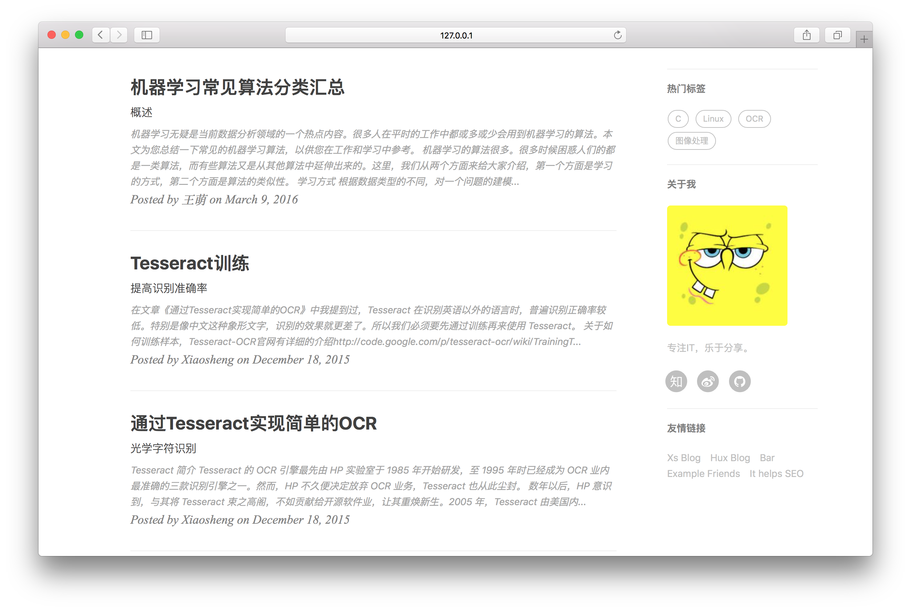

# 说明文档

* 开始
  * [环境要求](#environment)
  * [开始](#get-started)
  * [写一篇博文](#write-posts)
* 各组成部分
  * [侧边栏](#sidebar)
  * [自我简介](#mini-about-me)
  * [标签云](#featured-tags)
  * [好友链接](#friends)
* 评论与 Baidu Analytics
  * [评论](#comment)
  * [网站分析](#analytics)
* 高级部分
  * [标题底图](#header-image)
  * [搜索展示标题-头文件](#seo-title)
* 其他
  * [安装 jekyll](#install-jekyll)

### Environment

如果你已经安装了jekyll，那么你只需要切换到 *xs-huxblog* 目录，然后输入 `jekyll serve` 就能在本地浏览器中预览主题。

如果你还没有安装 jekyll，那么可以参考 [安装 Jekyll](#install-jekyll)。

### Get Started

你可以通用修改 *_config.yml* 文件轻松地开始搭建自己的博客：

```
# Site settings
title: 小昇的博客	              # 你的博客网站标题
SEOTitle: Xs Blog	           # 在后面会详细谈到
description: "Cool Blog"	   # 随便说点，描述一下
# SNS settings
github_username: jsksxs360     # 你的github账号
weibo_username: jsksxs360      # 你的微博账号
zhihu_username: jsksxs360      # 你的知乎账号
# Build settings
# paginate: 10                 # 一页你准备显示几篇文章
```

关于评论系统和网站统计的相关设置，请参考
[评论](#comment) 和 [网站分析](#analytics)。

Jekyll 官方网站还有很多的参数可以调，比如设置文章的链接形式...网址在这里：[Jekyll - Official Site](http://jekyllrb.com/) 中文版的在这里：[Jekyll中文](http://jekyllcn.com/)。

### write-posts

要发表的文章一般以 markdown 的格式放在目录 *_posts/* 下，你只要看看这篇模板里的文章就能立刻明白该如何设置。

yaml 头文件长这样:

```
---
layout: post
title: "Hello 2016"
subtitle: "Hello World, Hello Blog"
date: 2016-01-29 12:00:00
author: "Xiaosheng"
header-img: "img/bg/bg_2016.jpg"
catalog: true
tags:
    - Life
---
```

其中，layout 代表页面的类型，普通文章请设置为 post。catalog 为文章目录，会自动提取各级标题，显示在文章右侧。如下图所示：


### SideBar

长这样:



设置是在 *_config.yml* 文件里面的 `Sidebar settings` 那块。

```
# Sidebar settings
sidebar: true  #添加侧边栏
sidebar-about-description: "简单的描述一下你自己"
sidebar-avatar: /img/avatar-xs.jpg     #你的大头贴，请使用绝对地址.
```

侧边栏是响应式布局的，当屏幕尺寸小于 992px 的时候，侧边栏就会移动到底部。具体请见bootstrap栅格系统 <http://v3.bootcss.com/css/>。如果你不想使用侧边栏，可以设置 `sidebar: false`。


### Mini About Me

自我简介这个模块将在你的头像下面，展示你所有的社交账号。这个也是响应式布局，当屏幕变小时候，会将其移动到页面底部，只不过会稍微有点小变化，具体请看代码。

### Featured Tags

看到这个网站 [Medium](http://medium.com) 的标签云非常的炫酷，所有将他加了进来。
这个模块现在是独立的，可以呈现在所有页面，包括主页和发表的每一篇文章标题的头上。

```
# Featured Tags
featured-tags: true
featured-condition-size: 1     # A tag will be featured if the size of it is more than this condition value
```

### Friends

友情链接部分。这会在全部页面显示。

设置是在 *_config.yml* 文件里面的 `Friends` 那块，自己加吧。

```
# Friends
friends: [
    {
        title: "Foo Blog",
        href: "http://foo.github.io/"
    },
    {
        title: "Bar Blog",
        href: "http://bar.github.io"
    }
]
```

### Comment

博客采用 [网易云跟帖](https://gentie.163.com/) 评论系统。你需要去注册一个网易的账号，点击“获取代码”，然后找到其中类似 `productKey: "68cb5cb1ac1145f585ca0e38c1111b72"` 的部分。将后面的一串代码复制到 *_config.yml* 文件中：

```
gt_product_Key: 68cb5cb1ac1145f585ca0e38c1111b72
```

**注意，这个 product key 要用你们自己的。**

### Analytics

网站分析支持[百度统计](http://tongji.baidu.com)，你需要去官方网站注册一下。点击代码获取，然后在代码中找到类似 `hm.src = "//hm.baidu.com/hm.js?07529a93af5fa9f808261a1318c3aba4"` 的部分，将问号之后的一串数字复制到 *_config.yml* 文件中：

```
# Baidu Analytics
ba_track_id: 4cc1f2d8f3067386cc5cdb626a202900
```

**一定要使用你们自己的啊！**

### Header Image

标题底图是可以自己选的，看看几篇示例 post 你就知道如何设置了。

标题底图的选取完全是看个人的审美了，我也帮不了你。每一篇文章可以有不同的底图，你想放什么就放什么，最后宽度要够，大小不要太大，否则加载慢啊。

但是需要注意的是本模板的标题是**白色**的，所以背景色要设置为**灰色**或者**黑色**，总之深色系就对了。

### SEO Title

我的博客标题是 **“Xs Blog”** 但是我想要在搜索的时候显示 **“小昇的博客 | Xs Blog”** ，这个就需要 SEO Title 来定义了。

其实这个 SEO Title 就是定义了 `<head><title>标题</title></head>` 这个里面的东西和多说分享的标题，你可以自行修改的。

### Install Jekyll
因为 Jekyll 是用 Ruby 开发的，所以如果你的系统上没有安装，那么首先需要安装 Ruby。

注意，目前 Jekyll 已经更新到 3.x，安装 Jekyll 需要至少 2.0 版本的 Ruby，所以不要直接使用诸如 `sudo apt-get install ruby` 这样的命令安装，因为你软件仓库中的 Ruby 可能不是最新版。你可以使用下面的命令安装（使用 brightbox ppa 仓库）：

```
$ sudo apt-get install python-software-properties
$ sudo apt-add-repository ppa:brightbox/ruby-ng
$ sudo apt-get update
$ sudo apt-get install ruby2.1
$ sudo apt-get install ruby2.1-dev
```
安装后，输入 `ruby -v` 检查当前 Ruby 的版本，若正确显示则安装成功。

因为我们要通过 gem 来安装 jekyll，所以首先要确保 gem 已正确安装。输入 `gem -v`，若正确显示 gem 的版本号则安装成功。若报错则可能是因为未安装 Nodejs，可以通过 `sudo apt-get install nodejs` 来安装。

为了加快安装速度，建议将 gem 的数据源改为淘宝网的 RubyGems 镜像。

```
$ gem sources --remove https://rubygems.org/
$ gem sources --remove http://rubygems.org/
$ gem sources -a https://ruby.taobao.org/
$ gem sources -l
*** CURRENT SOURCES ***
https://ruby.taobao.org
# 请确保只有 ruby.taobao.org
```

然后安装 jekyll 和 rdiscount。

```
$ sudo gem install jekyll
$ sudo gem install rdiscount
```

至此 Jekyll 安装完成，你可以输入 `jekyll -v` 来检查，若正确显示 jekyll 的版本号则安装成功。

由于网站还使用到了分页功能，所以还需要安装 jekyll-paginate，你可以通过 `sudo gem install jekyll-paginate` 来安装。
